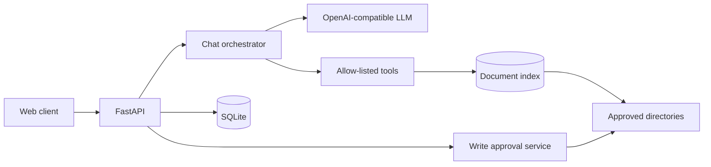

# SmartOps AI

[](https://github.com/muratshimshek/smartops-ai/actions/workflows/ci.yml)
[](https://www.python.org/)
[](LICENSE)
[](https://fastapi.tiangolo.com/)

SmartOps AI is a self-hosted operations assistant for permission-scoped document search, conversational troubleshooting, and approval-controlled file changes. It supports local OpenAI-compatible model servers such as Ollama as well as hosted providers.


## Capabilities

- FastAPI backend and responsive web interface
- OpenAI-compatible model adapter with native tool calling
- Local fallback mode for integration testing without a model provider
- Conversation persistence with bounded model context
- Administrator-managed filesystem allow-list
- Content indexing for PDF, Word, Excel, PowerPoint, and text formats
- Filename and path indexing for other file types
- Source citations with verified file links
- Mandatory approval workflow for file creation and replacement
- Backup, integrity check, path containment, and audit logging
- Automated tests that do not contact paid services

## Architecture



The model cannot access the filesystem directly. It can request only tools registered by the application. File tools query an index built from administrator-approved directories. A write proposal remains pending until an administrator explicitly approves it; the application then revalidates the target and creates a backup before replacement.

See [Architecture](docs/ARCHITECTURE.md) and [Security](docs/SECURITY.md) for implementation details.

Project history and contribution guidance are available in [CHANGELOG.md](CHANGELOG.md) and [CONTRIBUTING.md](CONTRIBUTING.md).

## Requirements

- Python 3.12 or newer
- Windows, Linux, or macOS for the API
- Windows for the optional native directory picker
- An OpenAI-compatible model server for natural-language responses

## Local setup

```powershell
py -3.12 -m venv .venv
.\.venv\Scripts\python.exe -m pip install -e ".[dev]"
Copy-Item .env.example .env
.\.venv\Scripts\python.exe -m uvicorn app.main:app --reload
```

Open the application at `http://localhost:8000` and API documentation at `http://localhost:8000/docs`.

Change `ADMIN_TOKEN` in `.env` before using the management panel. Never commit `.env`.

## Model providers

The management panel can test and activate an OpenAI-compatible endpoint. A typical local Ollama configuration is:

```text
Base URL: http://127.0.0.1:11434/v1
Model:    qwen3:8b
API key:  ollama
```

The connection must succeed before the application saves and activates the configuration. Provider credentials are written only to the ignored local `.env` file and are never returned by the API.

## Document access

Administrators register directories with `read` or `read_write` permission. Content extraction is available for `.txt`, `.md`, `.csv`, `.json`, `.log`, `.xml`, `.yaml`, `.yml`, `.pdf`, `.docx`, `.xlsx`, `.xlsm`, `.xls`, and `.pptx`. Other files remain searchable by filename and relative path. Files exceeding `MAX_INDEX_FILE_BYTES` are skipped.

Indexing never executes discovered files. Symbolic-link and traversal checks prevent access outside approved roots.

## Write approval flow

1. A client proposes a relative path and content.
2. The API verifies that the root has `read_write` permission.
3. The request is stored as `pending`; no file changes occur.
4. An administrator reviews and approves or rejects the request.
5. Approval rechecks the allowed root and the target file hash.
6. Replacements receive a timestamped backup before an atomic write.
7. The decision is recorded in the audit log.

## Configuration

| Variable | Default | Description |
|---|---|---|
| `APP_ENV` | `development` | Runtime environment |
| `LLM_MODE` | `demo` | `demo` or `live` |
| `LLM_BASE_URL` | OpenAI API endpoint | OpenAI-compatible API base URL |
| `LLM_MODEL` | `gpt-4o-mini` | Provider model identifier |
| `LLM_API_KEY` | empty | Provider credential; use a non-empty local value for Ollama |
| `LLM_TIMEOUT_SECONDS` | `30` | Provider timeout |
| `DATABASE_URL` | `sqlite:///./smartops.db` | SQLAlchemy database URL |
| `ADMIN_TOKEN` | development placeholder | Management API credential |
| `MAX_CONTEXT_MESSAGES` | `12` | Messages sent to the model |
| `MAX_REQUEST_BYTES` | `16384` | Maximum declared request size |
| `MAX_INDEX_FILE_BYTES` | `5242880` | Maximum indexed file size |
| `MAX_SEARCH_RESULTS` | `20` | Maximum document results |

## Testing

```powershell
.\.venv\Scripts\python.exe -m pytest
```

Tests use an in-memory database and a deterministic model substitute. They do not read the developer's `.env`, local document index, or provider credentials.

## Production boundary

This repository is suitable for local development and controlled demonstrations. Before multi-user or internet-facing deployment, add centralized identity, per-user document authorization, TLS, rate limiting, encrypted secret storage, database migrations, and a production database. Do not expose Ollama directly to the public internet.

## License

This project is available under the [MIT License](LICENSE).

