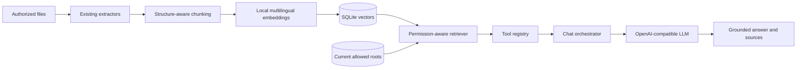

# Architecture

## Components

### API and web client

FastAPI serves the REST API, the OpenAPI schema, and a static web client. Request schemas define validation boundaries before data reaches application services.

### Model adapter

`LLMService` separates orchestration from a specific provider. `OpenAICompatibleLLMService` supports hosted APIs and local servers that implement the OpenAI chat-completions interface. The deterministic provider exists only for offline integration checks.

### Chat orchestration

The chat flow is deliberately bounded:

1. Load a limited conversation window.
2. Ask the model whether a registered tool is required.
3. Validate and execute requested tools.
4. Return tool observations to the model.
5. Store only the final user-facing response.

The application does not store hidden model reasoning.

### Document index

Administrators register filesystem roots and permissions. Indexing extracts text from supported formats and stores searchable metadata and content in SQLite. Unsupported formats are indexed by filename and relative path only. Search results include an opaque indexed-file identifier used by the download endpoint; clients do not choose arbitrary server paths.

### Permission-aware RAG

The optional RAG subsystem reuses `IndexedFile.content`; it does not duplicate file parsers. `DocumentChunker` preserves paragraph boundaries where practical and records reliable page, sheet, or slide labels emitted by the extractor. `EmbeddingProvider` isolates the local sentence-transformers implementation so tests and future providers can be substituted without changing retrieval logic.

`DocumentChunk` stores chunk text, source identifiers, a content hash, model identifier, structural location, and JSON-encoded vector in SQLite. This application-managed store was chosen over a separate vector service because the target deployment is local and small-to-medium, SQLite is already present, persistence is required, and current-permission joins are straightforward. It avoids unsafe pickle deserialization and an additional network service.

Retrieval first filters to enabled roots and matching embedding models, then resolves each current root and source file, verifies containment, and discards missing or unauthorized sources. Content hashes prevent unchanged documents from being embedded again. Changed documents replace their previous chunks in one database transaction. A full reindex removes orphaned vector records.

Keyword search remains available for exact terms. Semantic search is a separate operation; no score-normalization or hybrid-rank claim is made. RAG refers only to the chat flow where semantic results are returned through `semantic_search_documents` and supplied to the model for a grounded answer.

### Approval-controlled writes

Write proposals contain a relative target, proposed content, requester, and the target's expected hash. Approval revalidates the root, permission, containment, and hash. Existing targets are backed up before an atomic replacement. Every request and decision produces an audit record.

## Data model

- `Conversation` and `Message`: chat history
- `AllowedPath`: approved filesystem root and permission
- `IndexedFile`: extracted content and source metadata
- `DocumentChunk`: persistent semantic chunks, embeddings, hashes, and source metadata
- `FileWriteRequest`: pending and completed write proposals
- `FileAuditLog`: administrative file-operation history

## Trust boundaries

- Browser input is untrusted.
- Model output is untrusted and may only request registered tools.
- Tool arguments are validated before execution.
- Indexed content is data, never executable instruction.
- Semantic results are authorized at retrieval time; vector presence never grants access.
- Filesystem access is constrained to enabled allow-list roots.
- Administrative endpoints require a constant-time token check.

## Deployment evolution

SQLite and a shared administrator token keep local deployment simple. A multi-user deployment should replace them with PostgreSQL, migrations, SSO/OIDC, role-based access, per-document ACL filtering, managed secrets, and centralized audit retention.

